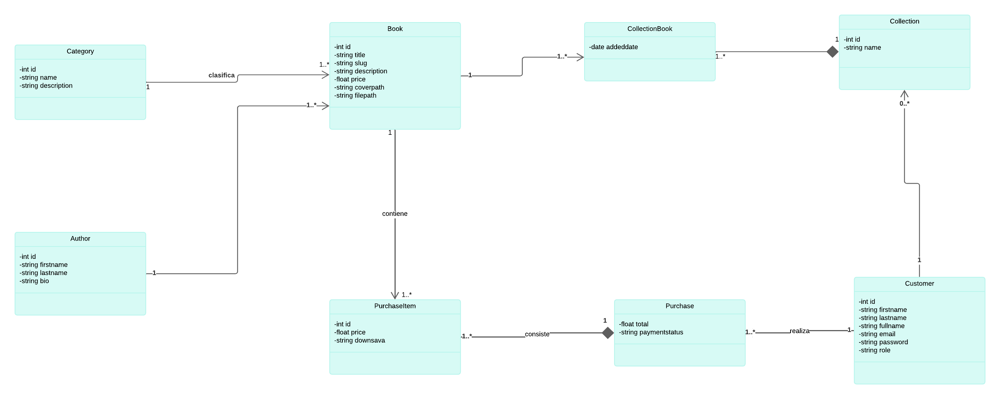
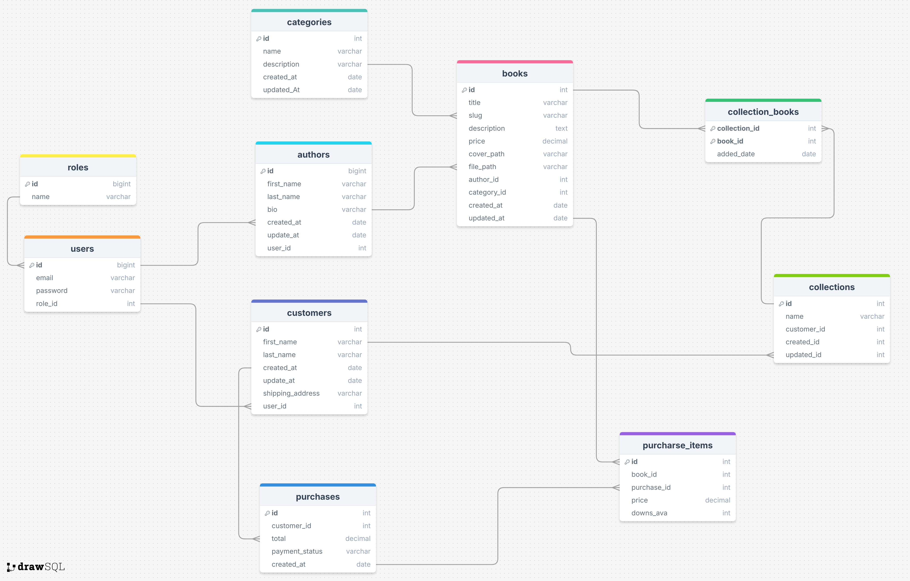

## Introducción

**BookHub** es una aplicación web diseñada para facilitar la compra de libros electrónicos y proporcionar una experiencia de usuario completa en la gestión de bibliotecas digitales personales. Con BookHub, los usuarios pueden crear una cuenta, iniciar sesión, y realizar pagos de manera segura a través de PayPal para adquirir sus libros favoritos. La aplicación permite a los administradores realizar operaciones CRUD (Crear, Leer, Actualizar, Eliminar) sobre libros, categorías y autores, gestionando de manera eficiente el catálogo de libros. Los usuarios pueden también organizar sus libros adquiridos en colecciones personalizadas.

El propósito de BookHub es ofrecer una plataforma integrada que combine la facilidad de compra de libros electrónicos, la gestión del catálogo por parte de administradores, y la personalización de bibliotecas digitales por parte de los usuarios, todo en un entorno seguro y amigable.

### Colaboradores del Proyecto

| **Nombre**                        | **Rol**                                     | **Perfil**                                                 |
|-----------------------------------|---------------------------------------------|------------------------------------------------------------|
| Henry Antonio Mendoza Puerta      | Líder del Proyecto | [LinkedIn](https://www.linkedin.com/in/hampcode/)           |

### Revisa el Progreso del Proyecto BookHub

| **Columna**       | **Descripción**                                                                                                                                    |
|-------------------|----------------------------------------------------------------------------------------------------------------------------------------------------|
| **Backlog**       | Contiene todas las historias de usuario, tareas y características que deben desarrollarse. Es el listado de todo el trabajo pendiente.              |
| **En Progreso**   | Incluye las tareas que están actualmente en desarrollo. Visualiza el trabajo en curso para asegurar el flujo continuo de trabajo.                   |
| **Revisión**      | Después de completar una tarea, se mueve aquí para una revisión de código y revisión por pares (peer review). Esta fase incluye la creación de **pull requests** para asegurar que el código cumpla con los estándares de calidad antes de integrarse al proyecto principal. |
| **En Pruebas**    | Contiene las tareas que han pasado la revisión de código y necesitan pruebas exhaustivas (unitarias, de integración y de aceptación) para garantizar su calidad. |
| **Hecho**         | Las tareas completamente desarrolladas, revisadas y probadas se mueven aquí, indicando que están listas y finalizadas.                               |

Mira cómo va avanzando nuestro trabajo visitando el siguiente enlace: [Tablero de Trello](https://trello.com/b/5sNtLdze).

### Funcionalidades de la Aplicación BookHub

#### **Módulo de Gestión de Usuarios**

- **Creación de Usuarios e Inicio de Sesión:**
    - Permitir a los usuarios registrarse en la plataforma.
    - Facilitar el inicio de sesión para acceder a la cuenta personal.
    - Mantener la seguridad de las credenciales de los usuarios.

#### **Módulo de Compras**

- **Compra de Libros Electrónicos:**
    - Integración con PayPal para pagos seguros y rápidos.
    - Procesamiento de transacciones para la compra de libros electrónicos.
    - Confirmación de la compra y entrega del libro en formato digital al usuario.

#### **Módulo de Gestión de Contenido**

- **Gestión de Libros:**
    - Añadir nuevos libros al catálogo.
    - Editar detalles de los libros existentes.
    - Eliminar libros del catálogo.
    - Listar todos los libros disponibles para los usuarios.

- **Categorías de Libros:**
    - Clasificar libros en diferentes categorías.
    - Facilitar la navegación y búsqueda de libros por categoría.
    - Mejorar la organización del catálogo de libros.

- **Gestión de Autores:**
    - Añadir nuevos autores a la base de datos.
    - Editar información de autores existentes.
    - Eliminar autores de la base de datos.
    - Mantener actualizada la información de los autores.

#### **Módulo de Biblioteca Personal**

- **Biblioteca Personal de Libros:**
    - Permitir a los usuarios organizar sus libros comprados en colecciones personalizadas o "estanterías virtuales".
    - Facilitar la creación, edición y eliminación de colecciones de libros.
    - Mejorar el acceso y la gestión de la biblioteca personal del usuario.

#### **Módulo de Reportes**

- **Reportes de Actividad y Ventas:**
    - Generar reportes de compras realizadas por los usuarios.
    - Mostrar estadísticas de ventas de libros.
    - Proveer información detallada sobre la actividad de los usuarios, como libros más comprados o autores más populares.

## Diagramas de la Aplicación

Para entender mejor la estructura y diseño de la aplicación "BookHub", revisa los siguientes diagramas:

### Diagrama de Clases

### Diagrama de Base de Datos

Este diagrama ilustra el esquema de la base de datos utilizada por la aplicación, mostrando las tablas, columnas, y relaciones entre las entidades.

### Descripción de Capas del Proyecto

| capa        | descripción                                                                                  |
|-------------|----------------------------------------------------------------------------------------------|
| api         | Contiene los controladores REST que manejan las solicitudes HTTP y las respuestas.            |
| entity      | Define las entidades del modelo de datos que se mapean a las tablas de la base de datos.      |
| repository  | Proporciona la interfaz para las operaciones CRUD y la interacción con la base de datos.      |
| service     | Declara la lógica de negocio y las operaciones que se realizarán sobre las entidades.         |
| service impl| Implementa la lógica de negocio definida en los servicios, utilizando los repositorios necesarios. |
